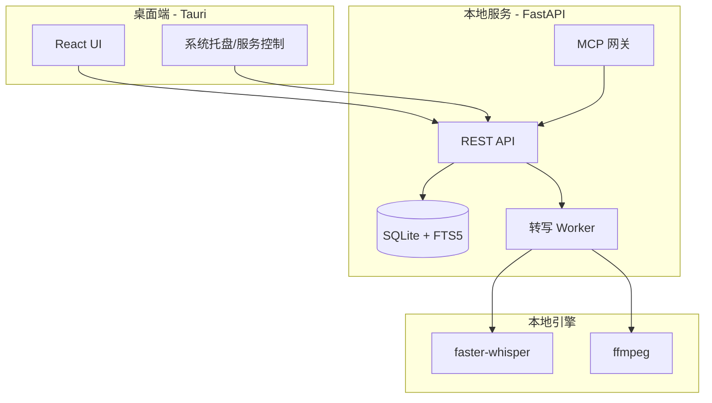

# EchoTrace 桌面版架构

## 总览

EchoTrace 是面向本地转写与知识整理的桌面产品，核心由桌面壳（Tauri）与本地服务（FastAPI + SQLite + faster-whisper）组成。

### 关键能力

- 本地音视频转写（faster-whisper）
- 时间轴分段与搜索（SQLite FTS5）
- 摘要与提取（MCP provider）
- 本地导出（txt / srt / md）

## 模块架构

## 数据流

1. 用户导入音视频 → 写入 `media` 表。
2. 创建转写任务 → `job` 表排队。
3. Worker 提取音频并转写 → 写入 `transcript` 与 `segment`。
4. UI 展示时间轴、搜索、导出。
5. MCP 进行摘要，结果写回 `transcript.summary`。

## MCP 接入

- MCP provider 配置由桌面端写入 `mcp-providers.json`。
- 支持 stdio 或 SSE server 两种接入方式。

## 目录说明

- `apps/desktop/`：Tauri + React 前端
- `apps/core/`：FastAPI + SQLite + Worker + MCP
- `legacy/`：历史 Web/Django 版本（仅供参考）
