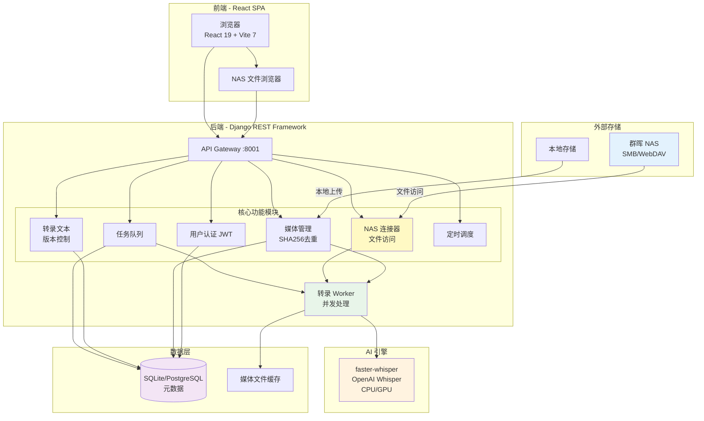
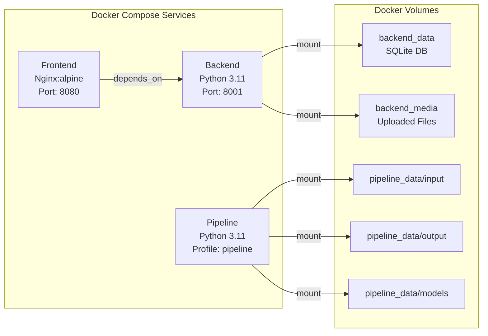
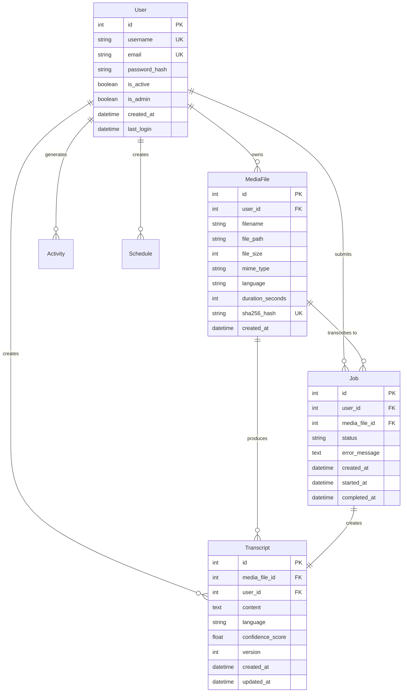

# EchoTrace 系统架构文档

> **文档版本**: 2.0  
> **最后更新**: 2025-10-26  
> **用途**: 技术评审和产品介绍

## 目录

1. [产品简介](#产品简介)
2. [系统架构](#系统架构)
3. [容器架构](#容器架构)
4. [数据库设计](#数据库设计)
5. [API 架构](#api-架构)
6. [技术栈](#技术栈)
7. [核心特性](#核心特性)
8. [性能优化](#性能优化)
9. [部署指南](#部署指南)
10. [未来规划](#未来规划)

---

## 产品简介

**EchoTrace（语迹）** 是一个智能媒体转录管理系统，基于 OpenAI Whisper 模型提供高精度语音识别能力。系统支持本地文件和群晖 NAS 文件的批量转录，配备完整的文本管理、版本控制和全文搜索功能。

### 核心功能
- 🎙️ **音视频转录**：支持多格式音视频文件自动转录（本地 + NAS）
- 📁 **NAS 集成**：直接访问群晖 NAS 文件系统，无需手动下载
- 📝 **版本管理**：转录文本完整版本控制，支持历史回溯
- 🔍 **全文搜索**：快速检索转录内容
- 👥 **权限管理**：基于角色的访问控制（管理员/编辑/查看者）
- 📊 **任务调度**：后台任务队列与定时任务支持
- 🔐 **文件去重**：SHA256 哈希自动去重，节省存储空间

### 应用场景
- 会议录音转写与归档
- 音视频内容索引与检索
- 媒体资产管理
- 知识库构建

---

## 系统架构



---

## 容器架构



### 容器详情

| 容器 | 基础镜像 | 用途 | 暴露端口 |
|------|----------|------|----------|
| **frontend** | nginx:alpine | 服务 React SPA，代理 API 请求 | 8080 → 80 |
| **backend** | python:3.11-slim | Django REST API，任务处理 | 8001 → 8001 |
| **pipeline** | python:3.11-slim | 批处理 CLI 工具 | N/A (按需) |

---

## 数据库设计



---

## API 架构

### 核心 API 端点

#### 认证 (`/api/auth/`)
```
POST   /api/auth/register/          - 用户注册
POST   /api/auth/login/             - 登录 (返回 JWT tokens)
POST   /api/auth/token/refresh/     - 刷新访问令牌
GET    /api/auth/me/                - 获取当前用户信息
PUT    /api/auth/me/                - 更新用户资料
```

#### 媒体管理 (`/api/media/`)
```
GET    /api/media/                  - 列出媒体文件
POST   /api/media/upload/           - 上传新媒体文件
GET    /api/media/:id/              - 获取文件详情
DELETE /api/media/:id/              - 删除文件
GET    /api/media/search/           - 搜索媒体文件
```

#### 转录管理 (`/api/transcripts/`)
```
GET    /api/transcripts/            - 列出转录文本
POST   /api/transcripts/            - 创建转录文本
GET    /api/transcripts/:id/        - 获取转录文本
PUT    /api/transcripts/:id/        - 更新转录文本
DELETE /api/transcripts/:id/        - 删除转录文本
GET    /api/transcripts/search/     - 搜索转录文本
POST   /api/transcripts/:id/export/ - 导出 (TXT/SRT/VTT)
```

#### 任务队列 (`/api/jobs/`)
```
GET    /api/jobs/                   - 列出任务
POST   /api/jobs/                   - 创建转录任务
GET    /api/jobs/:id/               - 获取任务详情
DELETE /api/jobs/:id/               - 取消/删除任务
GET    /api/jobs/worker/status      - 获取 Worker 状态
POST   /api/jobs/worker/control     - 控制 Worker (启动/停止/重启)
```

---

## 技术栈

### 前端
| 技术 | 版本 | 用途 |
|------|------|------|
| React | 19.1 | 核心 UI 框架 |
| React Router | 6.28 | 客户端路由 |
| Vite | 7.1.7 | 构建工具与开发服务器 |
| Tailwind CSS | latest | 样式框架 |
| Axios | 1.12.2 | HTTP 客户端 + JWT 拦截器 |
| Lucide React | latest | 图标库 |

### 后端
| 技术 | 版本 | 用途 |
|------|------|------|
| Django | 5.2 | Web 框架 |
| Django REST Framework | 3.14.0 | RESTful API |
| djangorestframework-simplejwt | latest | JWT 认证 |
| faster-whisper | 1.2.0 | 高性能 Whisper 引擎 |
| SQLite | 内置 | 开发数据库 |

### AI & 媒体处理
| 技术 | 用途 |
|------|------|
| faster-whisper | 转录引擎（比原生 Whisper 快 4-5 倍） |
| FFmpeg | 音频提取与分块处理 |
| CUDA（可选） | GPU 加速转录 |

---

## 核心特性

### NAS 文件访问能力
- **协议支持**：SMB、WebDAV
- **功能**：
  - 浏览 NAS 目录结构
  - 预览文件信息（大小、时长、格式）
  - 直接从 NAS 拉取文件进行转录
  - 无需手动下载，节省本地存储空间

### 转录工作流
1. **文件来源**：本地上传 或 NAS 文件选择
2. **去重检查**：SHA256 哈希避免重复转录
3. **任务创建**：自动创建转录任务并加入队列
4. **后台处理**：Worker 并发执行转录
5. **版本管理**：转录文本支持多版本编辑与回滚
6. **全文搜索**：转录完成后立即可搜索

### 权限控制
- **Admin**：完整系统管理权限
- **Editor**：媒体管理、转录编辑
- **Viewer**：只读访问

---

## 性能优化

### 转录性能
- **faster-whisper**：比原生实现快 4-5 倍，内存占用减少 50%
- **GPU 加速**：支持 CUDA（NVIDIA 显卡）
- **分块处理**：大文件自动分块，避免内存溢出
- **并发控制**：可配置 Worker 数量

### 存储优化
- **SHA256 去重**：识别重复文件，避免重复存储和转录
- **NAS 直连**：无需本地存储源文件，仅缓存必要数据

---

## 部署指南

### 快速启动（开发）

```bash
# 克隆仓库
git clone <repository-url>
cd echotrace

# 启动服务
docker-compose up -d

# 访问应用
# 前端: http://localhost:8080
# 后端 API: http://localhost:8001/api
```

### 系统要求

- **Docker**: 20.10+
- **Docker Compose**: 2.0+
- **磁盘空间**: 10GB+ (包含 Whisper 模型)
- **内存**: 4GB+ (推荐 8GB+ 用于中大型模型)
- **CPU**: 推荐多核用于转录

---

## 未来规划

### 近期（3 个月内）
- [x] 群晖 NAS 文件访问集成
- [ ] WebSocket 实时进度推送
- [ ] 转录结果导出（SRT/VTT 字幕格式）
- [ ] 单元测试与集成测试

### 中期（3-6 个月）
- [ ] 迁移至 PostgreSQL
- [ ] Celery + Redis 任务队列
- [ ] Redis 缓存层优化
- [ ] 多租户支持

### 长期（6-12 个月）
- [ ] 云端存储集成（S3/阿里云 OSS）
- [ ] 分布式转录集群
- [ ] 实时语音转录（流式处理）
- [ ] NLP 增强（自动摘要、关键词提取、说话人识别）
- [ ] 支持更多 NAS 品牌（威联通、铁威马等）

---

## 总结

EchoTrace 是一个现代化的媒体转录系统，具备以下优势：

✅ **技术栈现代化**：Django 5.2 + React 19 + Vite 7  
✅ **NAS 原生支持**：直接访问群晖 NAS，无需手动下载  
✅ **性能优异**：faster-whisper + GPU 加速 + 智能去重  
✅ **架构灵活**：模块化设计，易于扩展新功能  
✅ **企业级功能**：版本控制、权限管理、任务调度  

适用于需要处理大量音视频转录的团队和企业。