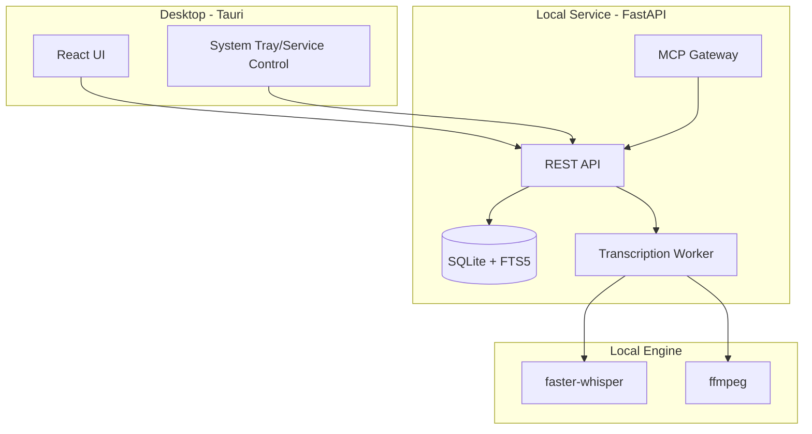

# EchoTrace Desktop Architecture

## Overview

EchoTrace is a desktop application for local transcription and knowledge management, built with Tauri shell and local services (FastAPI + SQLite + faster-whisper).

### Key Capabilities

- Local audio/video transcription (faster-whisper)
- Timeline segmentation & search (SQLite FTS5)
- Summarization & extraction (MCP provider)
- Local export (txt / srt / md)

## Module Architecture

## Data Flow

1. User imports audio/video → written to `media` table
2. Create transcription job → queued in `job` table
3. Worker extracts audio and transcribes → written to `transcript` and `segment`
4. UI displays timeline, search, export
5. MCP performs summarization → results written back to `transcript.summary`

## MCP Integration

- MCP provider config is written by desktop app to `mcp-providers.json`
- Supports stdio or SSE server connection modes

## Directory Structure

- `apps/desktop/`: Tauri + React frontend
- `apps/core/`: FastAPI + SQLite + Worker + MCP
- `legacy/`: Historical Web/Django version (reference only)
